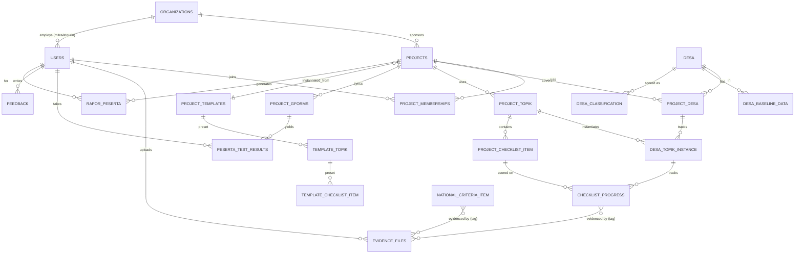

# Data Model & ERD

> Schema lengkap untuk Village Milestone Tracker. Dirancang multi-tenant dengan Row Level Security di Supabase. Versi: v0.1 (Foundation + Phase 1).

---

## 1. Entity Overview



## 2. Tables (Phase 0 + Phase 1)

### 2.1 Identity & Tenancy

#### `organizations`
Multi-tenant root. Atourin itself is an org; Mitra (BUMN, dinas, swasta) each have their own org.

| Column | Type | Notes |
|---|---|---|
| id | uuid PK | |
| name | text | "Atourin", "Kemenpar", "Bank Mandiri", etc |
| type | enum | `atourin` \| `mitra` |
| logo_url | text | Untuk branded report |
| brand_color_primary | text | Hex |
| created_at | timestamptz | |

#### `users`
Single user table for all roles. Role attached via `project_memberships`. Cross-project history therefore inherent.

| Column | Type | Notes |
|---|---|---|
| id | uuid PK | linked to `auth.users` (Supabase Auth) |
| full_name | text | |
| email | text unique | |
| phone | text | for WhatsApp notification |
| nik | text | optional, matching key for GForm sync |
| gender | enum | `L`\|`P` |
| birthdate | date | |
| address | text | |
| organization_id | uuid FK→organizations | null untuk peserta |
| global_role | enum | `superadmin`\|`mitra_admin`\|`peserta`\|`narasumber` (default scope; per-project role di membership table) |
| avatar_url | text | |
| created_by | uuid FK→users | siapa yang create (untuk audit bulk import) |
| created_at | timestamptz | |
| last_login_at | timestamptz | |

**Catatan**: `global_role` adalah default. Hak akses sebenarnya dihitung dari `project_memberships`. Seorang user bisa jadi `mitra_admin` di project A dan `peserta` di project B.

---

### 2.2 Project & Membership

#### `project_templates`
Library template yang Atourin curate. Project baru bisa instantiate dari sini.

| Column | Type | Notes |
|---|---|---|
| id | uuid PK | |
| name | text | "ADWI-Style 2024", "BUMDes Pemula", "Homestay Bali" |
| description | text | |
| default_modules | jsonb | `{baseline:true, topik:true, capacity_building:true, classification:false, ...}` |
| created_by | uuid FK→users | |
| created_at | timestamptz | |

#### `template_topik`
Topik default yang preset di template.

| Column | Type | Notes |
|---|---|---|
| id | uuid PK | |
| template_id | uuid FK | |
| name | text | "Kelembagaan", "Produk Wisata", etc |
| description | text | |
| sort_order | int | |

#### `template_checklist_item`
Checklist item default per topik. Sumber: kurasi Atourin + literatur.

| Column | Type | Notes |
|---|---|---|
| id | uuid PK | |
| template_topik_id | uuid FK | |
| title | text | "Membentuk Pokdarwis dengan SK Desa" |
| description | text | panduan untuk peserta |
| reference_url | text | link literatur |
| required | bool | wajib atau opsional |
| sort_order | int | |

#### `projects`
Instance project pendampingan.

| Column | Type | Notes |
|---|---|---|
| id | uuid PK | |
| organization_id | uuid FK→organizations | mitra pemilik dana |
| template_id | uuid FK→project_templates | nullable kalau dibikin from scratch |
| name | text | "Pendampingan ADWI 2024 Batch 3" |
| description | text | |
| period_start | date | |
| period_end | date | |
| status | enum | `draft`\|`active`\|`completed`\|`archived` |
| enabled_modules | jsonb | override default_modules dari template |
| public_dashboard_slug | text unique | untuk Phase 3 public link |
| public_dashboard_enabled | bool | |
| created_by | uuid FK→users | superadmin Atourin |
| created_at | timestamptz | |

#### `project_memberships`
Siapa terlibat di project mana, dengan role apa.

| Column | Type | Notes |
|---|---|---|
| id | uuid PK | |
| project_id | uuid FK | |
| user_id | uuid FK | |
| role | enum | `superadmin`\|`mitra_admin`\|`peserta`\|`pendamping`\|`narasumber` |
| desa_id | uuid FK→desa | kalau peserta, link ke desa yang diwakili |
| invited_by | uuid FK→users | |
| invited_at | timestamptz | |
| status | enum | `pending`\|`active`\|`removed` |

UNIQUE(project_id, user_id, role) — seseorang bisa punya >1 role di project sama jika dibutuhkan.

---

### 2.3 Desa & Baseline

#### `desa`
Master desa. Cross-project (desa Wanurejo yang sama bisa muncul di multiple project).

| Column | Type | Notes |
|---|---|---|
| id | uuid PK | |
| name | text | "Desa Wisata Wanurejo" |
| desa_kelurahan | text | "Wanurejo" |
| kecamatan | text | |
| kabupaten | text | |
| provinsi | text | |
| lat | numeric | |
| lng | numeric | |
| current_classification | enum | `rintisan`\|`berkembang`\|`maju`\|`mandiri`\|`unclassified` |
| classification_updated_at | timestamptz | |
| jadesta_id | text | future integration |
| created_at | timestamptz | |

#### `project_desa`
Desa yang diikutkan dalam project tertentu.

| Column | Type | Notes |
|---|---|---|
| id | uuid PK | |
| project_id | uuid FK | |
| desa_id | uuid FK | |
| classification_at_start | enum | klasifikasi desa saat masuk project |
| classification_target | enum | target di akhir project |
| coordinator_user_id | uuid FK→users | pendamping yang assigned |
| created_at | timestamptz | |

UNIQUE(project_id, desa_id).

#### `desa_baseline_data`
Data baseline yang fleksibel (form builder). Disimpan sebagai key-value untuk fleksibilitas, atau sebagai JSONB.

| Column | Type | Notes |
|---|---|---|
| id | uuid PK | |
| project_desa_id | uuid FK | |
| schema_version | text | versi form yang dipakai |
| data | jsonb | semua jawaban form |
| submitted_at | timestamptz | |
| submitted_by | uuid FK→users | |

#### `baseline_form_schemas`
Definisi field baseline yang configurable per project.

| Column | Type | Notes |
|---|---|---|
| id | uuid PK | |
| project_id | uuid FK | nullable, kalau null = global template |
| name | text | "Baseline ADWI Default" |
| version | text | semver |
| fields | jsonb | array of `{key, label, type, required, options, group}` |
| created_at | timestamptz | |

Field types: `text`, `textarea`, `number`, `date`, `select`, `multiselect`, `boolean`, `file`, `geopoint`, `repeater`.

---

### 2.4 Topik Pendampingan (Sistem A)

#### `project_topik`
Topik yang aktif di project ini. Bisa di-copy dari template_topik atau bikin baru.

| Column | Type | Notes |
|---|---|---|
| id | uuid PK | |
| project_id | uuid FK | |
| name | text | "Kelembagaan" |
| description | text | |
| source_template_topik_id | uuid FK→template_topik | nullable, kalau dari template |
| sort_order | int | |
| created_at | timestamptz | |

#### `project_checklist_item`
Checklist item di topik tersebut, untuk project ini.

| Column | Type | Notes |
|---|---|---|
| id | uuid PK | |
| project_topik_id | uuid FK | |
| title | text | |
| description | text | |
| required | bool | |
| reference_url | text | |
| sort_order | int | |
| created_at | timestamptz | |

#### `desa_topik_instance`
Pairing antara desa di project ini dengan topik yang harus dikerjakan.

| Column | Type | Notes |
|---|---|---|
| id | uuid PK | |
| project_desa_id | uuid FK | |
| project_topik_id | uuid FK | |
| status | enum | `not_started`\|`in_progress`\|`completed`\|`needs_revision` |
| completion_percent | numeric | computed |
| started_at | timestamptz | |
| completed_at | timestamptz | |

#### `checklist_progress`
Status per item checklist per desa.

| Column | Type | Notes |
|---|---|---|
| id | uuid PK | |
| desa_topik_instance_id | uuid FK | |
| project_checklist_item_id | uuid FK | |
| status | enum | `not_started`\|`submitted`\|`approved`\|`rejected` |
| submitted_by | uuid FK→users | peserta yang centang |
| submitted_at | timestamptz | |
| reviewed_by | uuid FK→users | Atourin yang review |
| reviewed_at | timestamptz | |
| review_note | text | feedback Atourin |

---

### 2.5 Evidence (reusable, tag ke multiple checklist)

#### `evidence_files`
Master file evidence.

| Column | Type | Notes |
|---|---|---|
| id | uuid PK | |
| project_desa_id | uuid FK | scope ownership |
| uploaded_by | uuid FK→users | |
| file_url | text | Supabase Storage |
| file_type | enum | `image`\|`video`\|`document`\|`audio` |
| file_size_bytes | int | |
| original_filename | text | |
| caption | text | |
| geo_lat | numeric | nullable |
| geo_lng | numeric | nullable |
| captured_at | timestamptz | dari EXIF kalau ada |
| uploaded_at | timestamptz | |

#### `evidence_tags`
Join table. Satu evidence bisa di-tag ke banyak checklist (Sistem A) atau kriteria (Sistem B).

| Column | Type | Notes |
|---|---|---|
| id | uuid PK | |
| evidence_id | uuid FK | |
| tag_type | enum | `checklist_progress`\|`national_criteria_progress` |
| tag_target_id | uuid | polymorphic FK |
| tagged_by | uuid FK→users | |
| tagged_at | timestamptz | |

---

### 2.6 Klasifikasi Desa (Sistem B — Stub)

> **Catatan**: Skema lengkap menunggu Permenparekraf terbit. Tabel disiapkan, isi data master pending.

#### `national_criteria_master`
Master kriteria klasifikasi. Versioned.

| Column | Type | Notes |
|---|---|---|
| id | uuid PK | |
| version | text | "permen_2025_v1" |
| effective_from | date | |
| effective_to | date | nullable |
| source_url | text | link Permen |
| created_at | timestamptz | |

#### `national_criteria_item`
Item kriteria per tier. STRUCTURE TENTATIVE — sesuaikan saat regulasi terbit.

| Column | Type | Notes |
|---|---|---|
| id | uuid PK | |
| master_id | uuid FK | |
| tier | enum | `rintisan`\|`berkembang`\|`maju`\|`mandiri` |
| category | text | "Kelembagaan", "Atraksi", dll (per Permen) |
| title | text | |
| description | text | |
| weight | numeric | bobot poin |
| required | bool | wajib atau pelengkap |
| sort_order | int | |

#### `desa_classification`
History klasifikasi desa.

| Column | Type | Notes |
|---|---|---|
| id | uuid PK | |
| desa_id | uuid FK | |
| tier | enum | hasil klasifikasi |
| score | numeric | |
| criteria_version | text | versi Permen yang dipakai |
| evaluated_at | timestamptz | |
| evaluated_by | uuid FK→users | nullable kalau auto |
| auto_calculated | bool | |
| note | text | |

#### `national_criteria_progress`
Centang per item kriteria per desa.

| Column | Type | Notes |
|---|---|---|
| id | uuid PK | |
| desa_id | uuid FK | |
| criteria_item_id | uuid FK | |
| status | enum | `not_started`\|`submitted`\|`verified`\|`rejected` |
| submitted_by | uuid FK | |
| verified_by | uuid FK | |
| verified_at | timestamptz | |

---

### 2.7 Capacity Building (RAPOR Peserta — Layer 3)

#### `project_gforms`
Konfigurasi Google Form yang di-sync per project.

| Column | Type | Notes |
|---|---|---|
| id | uuid PK | |
| project_id | uuid FK | |
| form_type | enum | `pre_test`\|`post_test`\|`survey_kepuasan`\|`survey_lainnya` |
| gform_id | text | ID Google Form |
| sheet_id | text | spreadsheet jawaban |
| identifier_field | text | nama field di GForm yang dipakai match peserta (mis. "email" atau "NIK") |
| sync_status | enum | `pending`\|`active`\|`error` |
| last_sync_at | timestamptz | |

#### `peserta_test_results`
Hasil setiap submission peserta.

| Column | Type | Notes |
|---|---|---|
| id | uuid PK | |
| project_gform_id | uuid FK | |
| user_id | uuid FK→users | hasil matching |
| raw_response | jsonb | semua field jawaban |
| score | numeric | nullable kalau test |
| max_score | numeric | |
| submitted_at | timestamptz | |
| matched_status | enum | `matched`\|`unmatched`\|`ambiguous` |

#### `rapor_peserta`
Aggregated RAPOR per peserta per project.

| Column | Type | Notes |
|---|---|---|
| id | uuid PK | |
| user_id | uuid FK | peserta |
| project_id | uuid FK | |
| pre_test_score | numeric | |
| post_test_score | numeric | |
| improvement_percent | numeric | computed |
| survey_kepuasan | jsonb | ringkasan |
| attendance | numeric | nullable, hari hadir |
| generated_at | timestamptz | |
| pdf_url | text | hasil generate |

---

### 2.8 Feedback, Notification, Audit

#### `feedback`
Generic feedback table (untuk evidence, checklist, atau open feedback).

| Column | Type | Notes |
|---|---|---|
| id | uuid PK | |
| target_type | enum | `checklist_progress`\|`evidence`\|`desa_baseline`\|`other` |
| target_id | uuid | |
| author_id | uuid FK | |
| body | text | |
| visibility | enum | `internal_atourin`\|`peserta`\|`mitra`\|`public` |
| created_at | timestamptz | |

#### `notifications`
Outbox pattern untuk WhatsApp/email/in-app.

| Column | Type | Notes |
|---|---|---|
| id | uuid PK | |
| user_id | uuid FK | |
| channel | enum | `in_app`\|`email`\|`whatsapp` |
| template_key | text | "feedback_received", "deadline_h-3", etc |
| payload | jsonb | data render template |
| status | enum | `pending`\|`sent`\|`failed` |
| scheduled_at | timestamptz | |
| sent_at | timestamptz | |
| error | text | |

#### `audit_log`
Compliance trail untuk project pemerintah.

| Column | Type | Notes |
|---|---|---|
| id | uuid PK | |
| actor_id | uuid FK→users | |
| action | text | "evidence.approved", "peserta.bulk_import", "project.published" |
| entity_type | text | |
| entity_id | uuid | |
| before | jsonb | |
| after | jsonb | |
| created_at | timestamptz | |

---

### 2.9 AI Insight (Phase 2)

#### `ai_insights`
Cache hasil AI agar tidak panggil tiap render.

| Column | Type | Notes |
|---|---|---|
| id | uuid PK | |
| target_type | enum | `project_desa`\|`project`\|`peserta` |
| target_id | uuid | |
| insight_type | enum | `summary`\|`recommendation`\|`stagnation_flag`\|`evidence_review` |
| content | jsonb | structured output dari Claude |
| model | text | "claude-opus-4-8" etc |
| generated_at | timestamptz | |
| valid_until | timestamptz | TTL |
| triggered_by | uuid FK→users | nullable kalau auto |

---

## 3. Row Level Security (RLS) Strategy

Semua tabel pakai RLS di Supabase. Helper function:

```sql
-- Returns project_ids user dapat akses
create or replace function auth_user_projects()
returns table(project_id uuid, role text) as $$
  select project_id, role::text
  from project_memberships
  where user_id = auth.uid() and status = 'active'
$$ language sql security definer;
```

Pola access:

| Role | Access |
|---|---|
| Superadmin Atourin | All rows (cek `users.global_role = 'superadmin'`) |
| Mitra | Rows where `project_id IN (select project_id from auth_user_projects())` |
| Peserta | Rows where `project_desa_id` belongs to desa user-nya |
| Pendamping | Rows of project mereka |

---

## 4. Constraints & Considerations

- **Email peserta tidak wajib unique global** — di desa banyak yang gak punya email, sehingga sistem provision email artificial format `nik+{nik}@peserta.atourin.id`. Mark `email_artificial=true`.
- **Phone wajib** untuk WhatsApp delivery (peserta).
- **Soft delete** pakai `deleted_at` di entity penting (users, projects, desa) — bukan hard delete.
- **JSONB fields** divalidasi di application layer + ada zod schema, jangan all-permissive.
- **Indexes** wajib: `project_memberships(user_id, status)`, `checklist_progress(desa_topik_instance_id)`, `evidence_tags(tag_type, tag_target_id)`, `audit_log(entity_type, entity_id)`.

---

## 5. Open Questions (perlu input lanjutan)

1. **National criteria structure** — final saat Permen terbit. Saat ini schema tentative berdasarkan asumsi: kriteria per tier, per kategori, dengan bobot.
2. **Peserta tanpa email/HP** — apakah tetap di-create user account, atau treat sebagai "passive participant" tanpa login (tracked di project tapi tidak login)?
3. **Multiple desa per project_membership** — apakah 1 peserta bisa mewakili >1 desa? Asumsi sementara: tidak, satu peserta = satu desa per project.
4. **Versioning checklist template** — kalau template Atourin update, apakah affect project yang sudah running? Asumsi: tidak, project snapshot saat instantiate.
