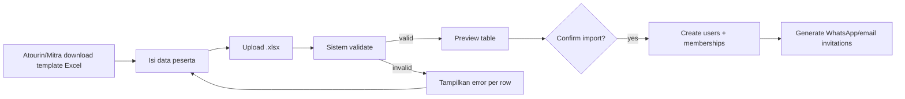

# Module Specifications

> Spec teknis dan behavioral untuk setiap modul. Referensi acuan saat development. Diorganisir berdasarkan prioritas Phase.

---

## Modul 1 — Project Management

**Phase**: 0 (foundation) + 1 (template engine)

### 1.1 Capabilities

- Create project dari blank atau dari template
- Configure modul yang aktif (Baseline, Topik, Capacity Building, Klasifikasi, dll)
- Assign Mitra org owner
- Define period (start–end)
- Enable/disable public dashboard
- Archive project saat selesai

### 1.2 Project Templates

Atourin curate library template. Saat project baru di-create:

1. Pilih template (atau "blank")
2. Sistem **copy** (snapshot) topik + checklist items ke `project_topik` / `project_checklist_item`
3. Setelah copy, project owner bebas edit tanpa affect template asli
4. Template di-update kemudian tidak affect existing project (kecuali manual re-sync)

### 1.3 Default 7 Topik (template starter)

Sebagai starter template "Pendampingan Standard":
1. Kelembagaan
2. Produk Wisata
3. Amenitas
4. Pemasaran
5. Resiliensi/Keberlanjutan
6. Produk Ekonomi Kreatif
7. Keuangan

Masing-masing punya checklist default (~8–15 item) dari kurasi literatur. Detail item: lihat seed data di `supabase/seed.sql`.

### 1.4 Flexibility per Project

- Tambah/hapus topik per project
- Tambah/hapus checklist item per topik
- Edit deskripsi, reference link, required flag
- Modul ON/OFF per project (mis. project pelatihan singkat tidak pakai modul Klasifikasi)

### 1.5 Acceptance Criteria

- ✅ Atourin create project dari template "ADWI-Style" dalam <1 menit
- ✅ Edit checklist item di project tidak mengubah template
- ✅ Disable modul "Klasifikasi" menyembunyikan semua UI terkait di scope project
- ✅ Status `draft` → tidak visible ke Mitra/Peserta sampai `active`

---

## Modul 2 — User Management & Bulk Import

**Phase**: 0 (foundation)

### 2.1 Capabilities

- Single user create (form)
- **Bulk import via Excel** (priority untuk peserta)
- Invite via link (peserta terima link, set password sendiri)
- Magic link login (alternatif password — bagus untuk desa)
- Cross-project history visible di profil user

### 2.2 Bulk Import Flow



### 2.3 Excel Template Columns

| Column | Required | Notes |
|---|---|---|
| full_name | yes | |
| email | conditional | wajib salah satu: email atau phone |
| phone | conditional | format 62xxx atau 08xxx, auto-normalize |
| nik | no | matching key untuk GForm |
| gender | yes | L atau P |
| birthdate | no | DD/MM/YYYY |
| desa_name | yes | match by name, fuzzy untuk typo ringan |
| role | yes | default "peserta" |

### 2.4 Validation

- Email format check
- Phone format check (Indonesian)
- Duplicate detection: existing email/phone → suggest "merge to existing user"
- Desa matching: kalau tidak ketemu, suggest create new desa atau pilih dari dropdown

### 2.5 Acceptance Criteria

- ✅ Bulk import 100 peserta dalam <30 detik
- ✅ Existing peserta (sudah pernah di project lain) ter-detect, di-merge ke akun yang sama
- ✅ Invitation auto-send via WhatsApp (Phase 2) atau email (Phase 0)
- ✅ Error report downloadable kalau ada baris yang fail

---

## Modul 3 — Desa Baseline

**Phase**: 1

### 3.1 Capabilities

- Form builder dinamis (drag drop atau YAML-style schema)
- Field types: text, textarea, number, date, select, multi-select, boolean, file, geopoint, repeater (grup berulang)
- Section grouping (mis. "Data Demografi", "Data Geografis", "Daya Tarik Wisata")
- Template baseline default (mengacu 53-an field ADWI sebagai starter)
- Versioning schema — kalau form diubah di tengah project, data lama tetap valid (schema_version stamped)

### 3.2 Baseline Template Default (mengacu referensi ADWI)

Sections:
1. Informasi Dasar (nama desa, kontak, koordinator)
2. Data Demografi (penduduk L/P, KK, RT/RW)
3. Data Geografis (lokasi, jarak, kondisi jalan, transportasi, air, energi, internet)
4. Daya Tarik Wisata (alam, budaya, kreatif, statistik wisatawan)
5. Amenitas (homestay, parkir, toilet, sarana)
6. Paket Wisata
7. Kelembagaan (Pokdarwis, BUMDes, peraturan)
8. Ekonomi Kreatif (kriya, kuliner, fesyen)
9. Kemitraan (PT, swasta, industri)
10. Resiliensi (sampah, mitigasi bencana, lingkungan)

### 3.3 Permission

- **Peserta**: isi & edit baseline desa-nya
- **Atourin/Mitra**: read-only kecuali ada flag "edit on behalf"
- **History**: setiap submit save snapshot — lihat perubahan over time

### 3.4 Acceptance Criteria

- ✅ Atourin tambah field "Jumlah Difabel" tanpa break existing data
- ✅ Peserta isi baseline bertahap, auto-save draft
- ✅ Output PDF baseline ter-format rapih untuk laporan

---

## Modul 4 — Topik Pendampingan & Checklist

**Phase**: 1

### 4.1 Capabilities

- Peserta lihat checklist per topik desa-nya
- Centang item → status `submitted`
- Attach 1+ evidence dari evidence library atau upload baru
- Atourin review → `approved` atau `rejected` dengan note
- Rejected item kembali ke peserta untuk revisi
- Progress bar per topik + overall project

### 4.2 Checklist Item Lifecycle

```
not_started → submitted → approved (final)
                      ↓
                   rejected → (peserta revise) → submitted → ...
```

### 4.3 UI Pattern

- **List view** dengan filter status
- **Bulk approve** untuk Atourin (centang multiple → approve sekali)
- Inline preview evidence saat review (tanpa pindah halaman)
- Comment thread di item (continuous feedback)

### 4.4 Acceptance Criteria

- ✅ Peserta centang item + attach evidence → Atourin terima notifikasi
- ✅ Atourin approve → peserta terima notifikasi + progress bertambah
- ✅ Atourin tidak bisa approve item yang tidak punya evidence (kalau item flagged `evidence_required`)

---

## Modul 5 — Evidence Management

**Phase**: 1

### 5.1 Capabilities

- Upload file (image, video, document, audio)
- **Evidence library per desa** — semua file ter-archive
- **Reusable tagging** — satu file di-tag ke banyak checklist (Topik) atau kriteria (Klasifikasi)
- Geotag + timestamp extraction dari EXIF (Phase 2 polish)
- File size limit: 10 MB image, 50 MB video, 5 MB document (configurable)
- Auto-thumbnail untuk image/video

### 5.2 Tagging Flow

Saat centang checklist item:
1. Modal "Pilih evidence" muncul
2. Tab 1: pilih dari library (file yang sudah ada)
3. Tab 2: upload baru
4. Confirm → file ter-tag ke checklist_progress ini
5. File yang sama bisa di-tag di tempat lain via menu "Tag ke checklist lain"

### 5.3 Phase 2 Enhancement (AI Evidence Review)

- Saat upload, AI Claude vision sample-check apakah file relevan dengan checklist title
- Output: `confidence: high/medium/low` + saran
- Atourin tetap final reviewer, AI hanya pre-screening

### 5.4 Acceptance Criteria

- ✅ Upload 1 foto SK Pokdarwis → tag ke "Topik Kelembagaan checklist X" dan "Kriteria Berkembang item Y" sekaligus
- ✅ Storage usage per desa visible
- ✅ Search evidence by caption, tag, atau filename

---

## Modul 6 — Milestone Engine & Klasifikasi Desa

**Phase**: 1 (stub) → 3 (full implementation saat Permen terbit)

### 6.1 Current State (Phase 1)

- Schema `national_criteria_*` ready tapi master data kosong
- UI "Klasifikasi" disabled by default per project (toggle di project settings)
- Field `desa.current_classification` bisa di-set manual oleh Atourin sebagai placeholder

### 6.2 Future Design (Phase 3, post-Permen)

#### 6.2.1 Scoring Engine

```typescript
interface ClassificationResult {
  tier: 'rintisan' | 'berkembang' | 'maju' | 'mandiri';
  score: number;
  per_category: Record<string, { score: number; max: number; gap: string[] }>;
  next_tier_gap: {
    items_remaining: NationalCriteriaItem[];
    points_needed: number;
  };
}
```

Algoritma:
1. Untuk setiap `national_criteria_item` di tier saat ini, cek `national_criteria_progress.status = 'verified'`
2. Sum weight item terverifikasi
3. Tier ditentukan oleh threshold (definisi di Permen — TBD)
4. Hitung gap ke tier berikutnya

#### 6.2.2 UI: Milestone Tracker

Peserta lihat visual progress:

```
Desa Wanurejo
[========████░░░░] 68% menuju BERKEMBANG

Untuk naik ke Berkembang, kamu butuh:
✓ Memiliki Pokdarwis aktif
✓ Punya daya tarik wisata utama
✗ Memiliki kemitraan dengan 1+ PT/industri  ← UPLOAD EVIDENCE
✗ Punya paket wisata yang sudah diuji      ← UPLOAD EVIDENCE
```

#### 6.2.3 Cross-link with Topik

Saat Permen terbit, Atourin manually atau via AI memetakan:
- Item topik X → kriteria nasional Y (tight mapping)
- Centang item topik → otomatis update progress kriteria yang ter-mapping
- Evidence yang ter-tag ke item topik bisa auto-suggest tag ke kriteria juga

### 6.3 Acceptance Criteria (Phase 3)

- ✅ Saat Permen terbit, Atourin seed master criteria dalam <1 hari
- ✅ Auto-calculate tier desa berdasarkan progress
- ✅ Peserta lihat gap ke tier berikutnya dengan checklist actionable

---

## Modul 7 — Capacity Building (RAPOR Peserta)

**Phase**: 1 (manual entry) → 2 (GForm auto-sync)

### 7.1 Capabilities

- Track pre-test, post-test, survey kepuasan, attendance per peserta per project
- Auto-generate RAPOR PDF per peserta
- Aggregate report per desa (rata-rata kelas)
- Aggregate report per project (untuk Mitra)
- History RAPOR lintas project di profil peserta

### 7.2 Google Form Sync (Phase 2)

#### Setup
1. Atourin config project: pilih form_type (pre/post/survey), input GForm ID + Sheet ID
2. Pilih `identifier_field` (kolom di GForm yang dipakai match peserta — biasanya email atau NIK)
3. Sistem schedule periodic sync (hourly) via Edge Function

#### Sync Logic
```typescript
async function syncGForm(projectGformId: string) {
  const responses = await fetchSheetRows(sheetId);
  for (const row of responses) {
    const identifier = row[identifierField];
    const user = await matchPeserta(projectId, identifier);
    if (!user) {
      saveAsUnmatched(row);
      continue;
    }
    await upsertTestResult({
      project_gform_id: projectGformId,
      user_id: user.id,
      raw_response: row,
      score: calculateScore(row, form_type),
      submitted_at: row.timestamp
    });
  }
}
```

#### Matching Strategy
1. Exact match by email (preferred)
2. Exact match by NIK
3. Fuzzy match by name + desa (last resort, mark `matched_status: ambiguous`)
4. Unmatched → admin queue untuk manual link

### 7.3 RAPOR PDF Template

Konten standar (configurable per mitra):
- Header dengan logo mitra + Atourin
- Identitas peserta (nama, desa, project)
- Pre-test vs Post-test score + delta
- Materi topik yang dibahas
- Attendance %
- Survey kepuasan (Likert summary)
- Sertifikat opsional (kalau threshold tercapai)
- Footer signature Atourin

Generate stack:
- React-PDF atau Puppeteer (HTML → PDF)
- Cached di Supabase Storage

### 7.4 Acceptance Criteria

- ✅ Peserta isi GForm → 1 jam kemudian skor masuk dashboard
- ✅ Unmatched response visible di admin queue dengan saran candidate user
- ✅ RAPOR auto-generated saat project status `completed`
- ✅ Peserta lihat semua RAPOR mereka di profil (lintas project)

---

## Modul 8 — AI Insight Engine

**Phase**: 2

### 8.1 Insight Types

#### 8.1.1 Desa Summary
**Trigger**: weekly atau on-demand
**Input**: baseline data + checklist progress + evidence + feedback
**Output**:
- 1 paragraf kondisi desa saat ini
- 3 highlights positif
- 3 area yang perlu dorongan
- Quick wins yang bisa dikerjakan

#### 8.1.2 Recommendation
**Trigger**: setelah review batch checklist
**Input**: checklist outstanding + topik prioritas + similar desa di project lain
**Output**: top 5 action item urut prioritas dengan reasoning

#### 8.1.3 Stagnation Flag
**Trigger**: cron harian
**Logic**: desa yang >30 hari tidak ada submission baru di topik aktif
**Output**: alert ke Atourin + pendamping → suggest intervention

#### 8.1.4 Evidence Auto-Review
**Trigger**: saat upload evidence di Phase 2
**Input**: file + checklist item title
**Output**: relevance score + suggested checklist tagging + flag kalau tidak sesuai

### 8.2 Implementation Pattern

```typescript
// Edge function (Gemini)
import { GoogleGenerativeAI, SchemaType } from '@google/generative-ai';

const genAI = new GoogleGenerativeAI(process.env.GEMINI_API_KEY!);

const SUMMARY_SCHEMA = {
  type: SchemaType.OBJECT,
  properties: {
    overview: { type: SchemaType.STRING },
    highlights: { type: SchemaType.ARRAY, items: { type: SchemaType.STRING } },
    areas_to_push: { type: SchemaType.ARRAY, items: { type: SchemaType.STRING } },
    quick_wins: { type: SchemaType.ARRAY, items: { type: SchemaType.STRING } }
  },
  required: ['overview', 'highlights', 'areas_to_push', 'quick_wins']
};

export async function generateDesaSummary(projectDesaId: string) {
  const context = await assembleContext(projectDesaId);
  const cached = await getValidInsight(projectDesaId, 'summary');
  if (cached) return cached;

  const model = genAI.getGenerativeModel({
    model: process.env.GEMINI_MODEL_SUMMARY!, // gemini-2.5-flash
    systemInstruction: SUMMARY_SYSTEM_PROMPT,
    generationConfig: {
      responseMimeType: 'application/json',
      responseSchema: SUMMARY_SCHEMA,
      maxOutputTokens: 1500
    }
  });

  const result = await model.generateContent(context);
  const structured = JSON.parse(result.response.text());

  return saveInsight({
    target_type: 'project_desa',
    target_id: projectDesaId,
    insight_type: 'summary',
    content: structured,
    model: process.env.GEMINI_MODEL_SUMMARY!,
    input_tokens: result.response.usageMetadata?.promptTokenCount,
    output_tokens: result.response.usageMetadata?.candidatesTokenCount,
    valid_until: addDays(now(), 7)
  });
}
```

**Provider abstraction recommendation**: bungkus AI call di `src/lib/ai/provider.ts` dengan interface generik (`generateStructured(prompt, schema)` → `T`). Ini bikin swap ke Claude/OpenAI nanti tinggal ganti adapter, tidak perlu refactor seluruh codebase.

### 8.3 Cost & Caching

- Cache 7 hari untuk summary, 24 jam untuk recommendation
- Invalidate cache saat data baseline atau checklist progress berubah
- Display "Last updated: 2 hari lalu — refresh" agar user tahu freshness

### 8.4 Acceptance Criteria

- ✅ Atourin klik "Generate Summary" → hasil muncul <15 detik
- ✅ Insight tersimpan, refresh tidak panggil API ulang
- ✅ Output structured (bukan free-text aja) agar UI bisa render highlight box

---

## Modul 9 — Reporting & Public Dashboard

**Phase**: 3

### 9.1 Capabilities

- Branded PDF export per project (laporan akhir untuk Mitra)
- Excel export raw data (untuk analisis Mitra)
- Public shareable dashboard URL per project
- Cohort comparison antar project
- Per-desa drill-down

### 9.2 Public Dashboard

- URL format: `app.atourin.id/public/[slug]`
- Toggle on/off per project
- Tidak ekspose data pribadi peserta (hanya agregat)
- Logo Mitra prominent
- Embeddable (iframe) untuk website sponsor

### 9.3 Acceptance Criteria

- ✅ Mitra klik "Export Laporan Akhir" → PDF branded ready <1 menit
- ✅ Public dashboard hide nama peserta tapi tampilkan progress desa
- ✅ Cohort compare: project 2024 vs 2025 side-by-side

---

## Modul 10 — Notification

**Phase**: 0 (email) → 2 (WhatsApp)

### 10.1 Channel Strategy

| Audience | Primary | Fallback |
|---|---|---|
| Atourin staff | In-app + email | — |
| Mitra | Email + in-app | — |
| Peserta desa | **WhatsApp** | Email |

### 10.2 Trigger Events

| Event | Recipient |
|---|---|
| New project invitation | Mitra, peserta |
| Checklist feedback received | Peserta |
| New evidence submitted | Atourin (pendamping) |
| Deadline H-3 | Peserta |
| Weekly digest | Mitra |
| Stagnation alert | Atourin + pendamping |

### 10.3 WhatsApp Integration

Pilihan provider: Fonnte (Indonesian, murah) atau Twilio (global, mahal).
Implementasi via Supabase Edge Function dengan template message pre-approved.

### 10.4 Acceptance Criteria

- ✅ Peserta terima WA notifikasi feedback dalam 5 menit dari Atourin approve
- ✅ User bisa opt-out per channel
- ✅ Failed delivery retry 3x dengan exponential backoff
