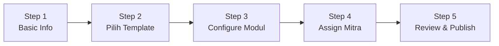
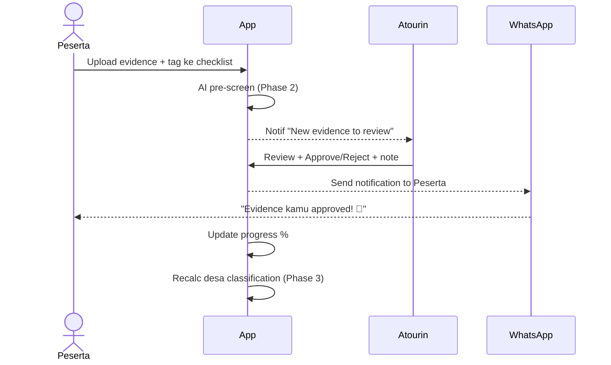
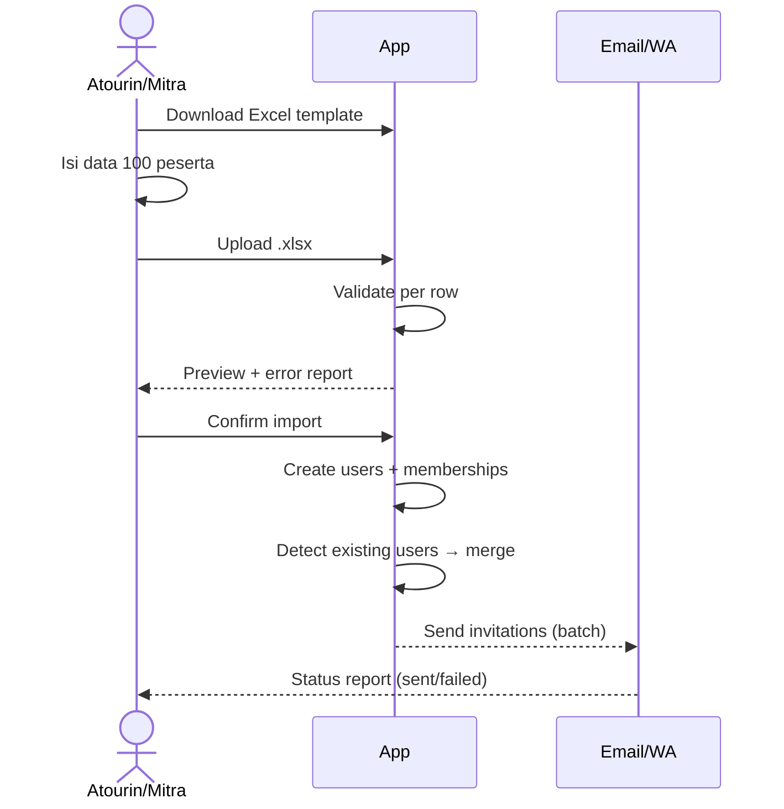
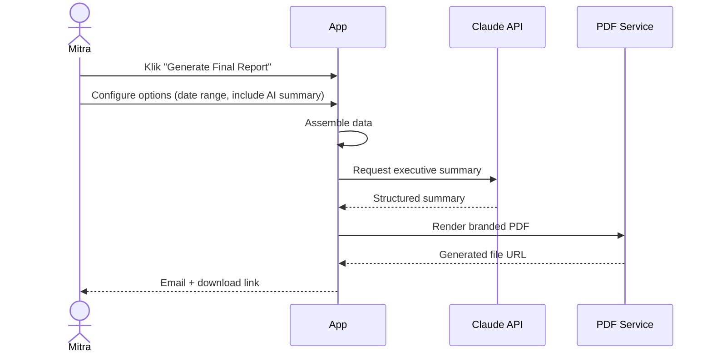

# Wireframes per Role

> Flow utama untuk 3 role inti: **Atourin** (superadmin), **Mitra**, **Peserta**. Format: screen-by-screen structure + key actions + state. Visual mockup tinggal diturunkan ke Figma dari spec ini.

---

## Role 1 — Atourin (Superadmin)

### A1. Login → Dashboard Utama

```
┌─────────────────────────────────────────────────────────────┐
│ [Atourin Logo]                          Notif🔔  Profile▼   │
├─────────────────────────────────────────────────────────────┤
│  Dashboard │ Projects │ Templates │ Users │ Insights        │
├─────────────────────────────────────────────────────────────┤
│                                                              │
│  Overview                                                    │
│                                                              │
│  ┌──────────┐ ┌──────────┐ ┌──────────┐ ┌──────────┐       │
│  │ 12       │ │ 248      │ │ 1,840    │ │ 84%      │       │
│  │ Active   │ │ Desa     │ │ Peserta  │ │ Topik    │       │
│  │ Projects │ │          │ │          │ │ Avg done │       │
│  └──────────┘ └──────────┘ └──────────┘ └──────────┘       │
│                                                              │
│  🔴 Needs Attention (3)                                      │
│  • 5 evidence menunggu review di "ADWI 2024 Batch 3"        │
│  • Desa Wanurejo stagnan 32 hari                            │
│  • Bulk import failed 2 row di "Pelatihan BUMN"             │
│                                                              │
│  📊 Active Projects                                          │
│  ┌──────────────────────────────────────────────────────┐  │
│  │ Project              Mitra      Desa  Progress  Action│  │
│  │ ADWI 2024 Batch 3    Kemenpar   53    ████░ 78% [👁] │  │
│  │ Pelatihan BUMN       BRI        15    ██░░░ 42% [👁] │  │
│  │ Homestay Bali        Pemda Bali 8     █░░░░ 18% [👁] │  │
│  └──────────────────────────────────────────────────────┘  │
└──────────────────────────────────────────────────────────────┘
```

**Key actions**: `+ New Project`, klik project → drill-down, klik action item → langsung ke konteks.

---

### A2. Create Project (Wizard)



**Step 1** — Nama, deskripsi, period start–end, kategori program
**Step 2** — Pilih dari template library atau "Start blank". Preview: berapa topik, berapa checklist item, default modul.
**Step 3** — Toggle modul:
  - ☑ Desa Baseline
  - ☑ Topik Pendampingan
  - ☑ Capacity Building (RAPOR)
  - ☐ Klasifikasi Nasional (disable kalau Permen belum terbit)
  - ☐ Public Dashboard

**Step 4** — Pilih Mitra org dari dropdown atau create new. Invite Mitra admin via email.
**Step 5** — Summary + button "Save as Draft" atau "Publish & Invite".

---

### A3. Project Detail (Drill-down)

```
┌─────────────────────────────────────────────────────────────┐
│ ← Projects                                                    │
│ ADWI 2024 Batch 3                          [Settings] [Export]│
│ Mitra: Kemenpar  •  19 Aug 2024 – 26 Oct 2024  •  ACTIVE   │
├─────────────────────────────────────────────────────────────┤
│  Overview │ Desa │ Topik │ Peserta │ Evidence │ Insights      │
├─────────────────────────────────────────────────────────────┤
│                                                              │
│  ┌─────────────────────────────────────────────────────┐   │
│  │ Progress Overall                                     │   │
│  │ ████████████░░░░ 78%                                 │   │
│  │ Topik approved: 245/315                              │   │
│  └─────────────────────────────────────────────────────┘   │
│                                                              │
│  Desa List                              [+Tambah] [Bulk Import]│
│  ┌──────────────────────────────────────────────────────┐  │
│  │ # │ Nama Desa        │ Koordinator │ Progress │ Tier │  │
│  │ 1 │ Jatimulyo        │ Agus S.    │ 92% ████ │ Maju │  │
│  │ 2 │ Wanurejo         │ Eko H.     │ 78% ███░ │ Maju │  │
│  │ 3 │ Pesona Gn Prau   │ Sabda E.   │ 45% █░░░ │ Rint │  │
│  │ ...                                                   │  │
│  └──────────────────────────────────────────────────────┘  │
└──────────────────────────────────────────────────────────────┘
```

**Tab Desa** → list semua desa dengan progress. Click row → drill ke Desa Detail.
**Tab Topik** → matrix view: topik × desa, cell menunjukkan completion %.
**Tab Evidence** → review queue + library project.
**Tab Insights** → AI summary, stagnation alerts, comparison.

---

### A4. Desa Detail (dalam Project)

```
┌─────────────────────────────────────────────────────────────┐
│ ← Project / Desa                                              │
│ Desa Wisata Wanurejo                          [Export PDF]   │
│ Koordinator: Eko Haryanto • Tier saat ini: Berkembang        │
├─────────────────────────────────────────────────────────────┤
│  Baseline │ Topik │ Klasifikasi │ Evidence │ AI Insight       │
├─────────────────────────────────────────────────────────────┤
│                                                              │
│  AI Summary                                Generated 2 hr ago │
│  ┌──────────────────────────────────────────────────────┐  │
│  │ Desa Wanurejo menunjukkan progress kuat di Pemasaran │  │
│  │ dan Amenitas (>85%). Area yang stagnan: Kelembagaan  │  │
│  │ — SK Pokdarwis belum di-upload selama 3 minggu.      │  │
│  │ Rekomendasi: prioritaskan finalisasi struktur lembaga│  │
│  │ sebelum akhir bulan untuk naik ke tier Maju.         │  │
│  │ [Lihat detail rekomendasi →]                          │  │
│  └──────────────────────────────────────────────────────┘  │
│                                                              │
│  Progress per Topik                                          │
│  Kelembagaan          ██░░░░░ 30%   🔴 Stagnant 21 days     │
│  Produk Wisata        █████░░ 75%                            │
│  Amenitas             ██████░ 90%                            │
│  Pemasaran            ██████░ 87%                            │
│  Resiliensi           ████░░░ 60%                            │
│  Ekonomi Kreatif      ███░░░░ 45%                            │
│  Keuangan             ████░░░ 55%                            │
└──────────────────────────────────────────────────────────────┘
```

---

### A5. Review Evidence Queue

```
┌─────────────────────────────────────────────────────────────┐
│ Evidence Review Queue                  Filter: [All Projects▼]│
├─────────────────────────────────────────────────────────────┤
│ ☐ Select all     [Approve Selected]  [Reject Selected]      │
│                                                              │
│ ┌──────────────────────────────────────────────────────────┐│
│ │ ☐ │ [thumbnail] │ Desa Wanurejo                          ││
│ │   │             │ Topik: Kelembagaan                     ││
│ │   │             │ Checklist: "Memiliki SK Pokdarwis"     ││
│ │   │             │ Caption: "SK ditandatangani 12 Juni"   ││
│ │   │             │ AI Confidence: ⚠️ Low — perlu cek manual││
│ │   │             │ Submitted by Eko H. • 2 hours ago      ││
│ │   │             │ [👁 Preview] [✓ Approve] [✗ Reject]    ││
│ └──────────────────────────────────────────────────────────┘│
│ ┌──────────────────────────────────────────────────────────┐│
│ │ ☐ │ [thumbnail] │ Desa Jatimulyo                         ││
│ │   │             │ ...                                     ││
│ └──────────────────────────────────────────────────────────┘│
└──────────────────────────────────────────────────────────────┘
```

**Pattern**: review tanpa pindah halaman (modal preview), bulk actions, AI pre-screening visible tapi human-final.

---

## Role 2 — Mitra

### M1. Mitra Dashboard

```
┌─────────────────────────────────────────────────────────────┐
│ [Mitra Logo + Atourin]                  Notif🔔  Profile▼   │
├─────────────────────────────────────────────────────────────┤
│  My Projects │ Reports │ Peserta                              │
├─────────────────────────────────────────────────────────────┤
│                                                              │
│  Welcome back, Pak Budi (Kemenpar)                          │
│                                                              │
│  Your Projects                                               │
│  ┌──────────────────────────────────────────────────────┐  │
│  │ ADWI 2024 Batch 3                                    │  │
│  │ 53 Desa  •  78% Progress  •  Ends in 21 days        │  │
│  │ ████████████░░░░░ 78%                                │  │
│  │ [Lihat Progress] [Download Report]                   │  │
│  └──────────────────────────────────────────────────────┘  │
│  ┌──────────────────────────────────────────────────────┐  │
│  │ Pelatihan Sapta Pesona                               │  │
│  │ 12 Desa  •  COMPLETED                                │  │
│  │ [Lihat Final Report]                                 │  │
│  └──────────────────────────────────────────────────────┘  │
│                                                              │
│  📊 Highlight Minggu Ini                                     │
│  • 8 desa naik progress >10%                                │
│  • Top performer: Jatimulyo (92%)                           │
│  • Perhatian: 3 desa stagnan >2 minggu                      │
└──────────────────────────────────────────────────────────────┘
```

---

### M2. Mitra Project View (Read-Mostly)

Mitra lihat hampir semua yang Atourin lihat di Project Detail, **kecuali**:
- Tidak bisa edit project setting
- Tidak bisa approve/reject evidence
- Tidak bisa edit checklist items
- Bisa add peserta (kalau permission diaktifkan oleh Atourin)
- Bisa comment di feedback thread (visibility: `mitra`)

Tambahan tab yang prominent untuk Mitra:
- **Reports** — download branded PDF & Excel, custom date range
- **Peserta Performance** — agregat RAPOR per desa

---

### M3. Mitra Report Export

```
┌─────────────────────────────────────────────────────────────┐
│ Generate Report — ADWI 2024 Batch 3                         │
├─────────────────────────────────────────────────────────────┤
│  Report Type:                                                │
│  ◉ Final Project Report (PDF, branded)                       │
│  ○ Per-Desa Detail (PDF, multi-page)                         │
│  ○ Raw Data Export (Excel, all tables)                       │
│  ○ Capacity Building Summary (PDF + RAPOR per peserta zip)   │
│                                                              │
│  Date Range:        [19 Aug 2024 ──────── 26 Oct 2024]      │
│                                                              │
│  Include:                                                    │
│  ☑ Executive summary (AI-generated)                         │
│  ☑ Desa progress chart                                      │
│  ☑ Topik breakdown                                          │
│  ☑ Foto kegiatan                                            │
│  ☐ Verbatim feedback Atourin (internal-only excluded)       │
│                                                              │
│                              [Cancel]  [Generate Report]    │
└──────────────────────────────────────────────────────────────┘
```

Generated PDF arrives via email + downloadable di Reports tab. Logo Mitra di header, logo Atourin di footer.

---

## Role 3 — Peserta

> **Mobile-first**. Banyak peserta akses dari HP. Wireframe di bawah dalam format mobile-portrait dulu.

### P1. Peserta Mobile Home

```
┌──────────────────────────┐
│ ☰  Wanurejo      🔔  👤  │
├──────────────────────────┤
│                          │
│ Halo, Eko Haryanto       │
│ Desa Wanurejo            │
│                          │
│ Progress Pendampingan    │
│ ████████░░░ 78%          │
│                          │
│ Tier saat ini:           │
│ 🟢 BERKEMBANG            │
│ 12% lagi → MAJU          │
│                          │
│ 📋 Yang perlu kamu       │
│    kerjakan minggu ini   │
│                          │
│ ┌──────────────────────┐ │
│ │ ⚠ Revisi             │ │
│ │ SK Pokdarwis perlu   │ │
│ │ diupdate dengan      │ │
│ │ tanggal terbaru      │ │
│ │             [Buka →] │ │
│ └──────────────────────┘ │
│                          │
│ ┌──────────────────────┐ │
│ │ ⏱ Deadline H-3       │ │
│ │ Upload paket wisata  │ │
│ │             [Buka →] │ │
│ └──────────────────────┘ │
│                          │
│ ┌──────────────────────┐ │
│ │ ✓ Approved           │ │
│ │ Foto homestay disetu-│ │
│ │ jui oleh Atourin     │ │
│ │             [Lihat]  │ │
│ └──────────────────────┘ │
└──────────────────────────┘
```

---

### P2. Peserta — Topik & Checklist

```
┌──────────────────────────┐
│ ← Topik Pendampingan     │
├──────────────────────────┤
│ Filter: [All ▼]          │
│                          │
│ Kelembagaan          30% │
│ ▾ 2/7 selesai            │
│   ┌────────────────────┐ │
│   │ ✓ Form Pokdarwis  │ │
│   │ ✓ Daftar anggota  │ │
│   │ ⚠ SK Pokdarwis    │ │ ← rejected, needs revision
│   │ ○ Peraturan Desa  │ │
│   │ ○ MOU dengan TIC  │ │
│   │ ○ Kode etik       │ │
│   │ ○ SOP layanan     │ │
│   └────────────────────┘ │
│                          │
│ Produk Wisata        75% │
│ ▸ ...                    │
│                          │
│ Amenitas             90% │
│ ▸ ...                    │
└──────────────────────────┘
```

---

### P3. Peserta — Checklist Detail + Upload Evidence

```
┌──────────────────────────┐
│ ← Kelembagaan            │
├──────────────────────────┤
│ Memiliki SK Pokdarwis    │
│                          │
│ Status: ⚠ Needs Revision │
│                          │
│ 💬 Feedback Atourin:     │
│ "Mohon update SK karena  │
│  tanggal di dokumen masih│
│  2022. Tolong ganti      │
│  dengan SK terbaru."     │
│  — Rivo, 2 hari lalu     │
│                          │
│ Evidence saat ini:       │
│ ┌────────────────────┐  │
│ │ [PDF preview]       │  │
│ │ SK_Pokdarwis_2022.pdf│ │
│ │ Uploaded 12 Jun '26│  │
│ └────────────────────┘  │
│                          │
│ [📷 Ganti Evidence]      │
│                          │
│ Panduan:                 │
│ • SK yang sah dari Kades │
│ • Tanggal masih aktif    │
│ • Format PDF/foto jelas  │
│ [Baca panduan lengkap →] │
└──────────────────────────┘
```

---

### P4. Peserta — Upload Evidence

```
┌──────────────────────────┐
│ ← Upload Evidence        │
├──────────────────────────┤
│ Untuk: SK Pokdarwis      │
│                          │
│ [📷 Foto / 📁 File]      │
│                          │
│  Atau pilih dari Library │
│  ┌─────────┬─────────┐  │
│  │ [thumb] │ [thumb] │  │
│  │ SK 2024 │ Foto SK │  │
│  └─────────┴─────────┘  │
│  ┌─────────┬─────────┐  │
│  │ [thumb] │ [thumb] │  │
│  │ Daftar  │ Acara   │  │
│  └─────────┴─────────┘  │
│                          │
│ Caption (opsional):      │
│ ┌──────────────────────┐ │
│ │                      │ │
│ └──────────────────────┘ │
│                          │
│ ☑ Lampirkan lokasi GPS   │
│                          │
│      [Batal] [Submit]    │
└──────────────────────────┘
```

---

### P5. Peserta — Profile + RAPOR Lintas Project

```
┌──────────────────────────┐
│ ← Profile                │
├──────────────────────────┤
│       [Avatar]           │
│   Eko Haryanto           │
│   Desa Wanurejo          │
│                          │
│ 📊 Project History (3)   │
│                          │
│ ┌──────────────────────┐ │
│ │ ADWI 2024 Batch 3    │ │
│ │ Aktif • Magelang     │ │
│ │ Pre: 65 → Post: pending│
│ │ [Lihat RAPOR →]      │ │
│ └──────────────────────┘ │
│                          │
│ ┌──────────────────────┐ │
│ │ Pelatihan Sapta 2023 │ │
│ │ ✓ Selesai            │ │
│ │ Pre: 50 → Post: 78   │ │
│ │ ↑ +56% peningkatan   │ │
│ │ [Download Sertifikat]│ │
│ └──────────────────────┘ │
│                          │
│ ┌──────────────────────┐ │
│ │ Bootcamp Homestay '22│ │
│ │ ✓ Selesai            │ │
│ │ [Lihat RAPOR]        │ │
│ └──────────────────────┘ │
└──────────────────────────┘
```

---

## Flow Diagrams — Cross-Role Interactions

### Flow 1 — Evidence Submit → Review → Notify



### Flow 2 — Bulk Import Peserta



### Flow 3 — Mitra Generate Report



---

## Summary Pattern

- **Atourin**: control center, review-heavy, AI-assisted decision making
- **Mitra**: read-mostly, report-focused, low-friction visibility
- **Peserta**: mobile-first, single-task focused per screen, friendly tone, WhatsApp-driven engagement
